# Jarkom-Modul-5-A11-2023

**Praktikum Jaringan Komputer Modul 5 Tahun 2023**

## Penulis

| Nama                | NRP        | Github                         |
| ------------------- | ---------- | ------------------------------ |
| Muhammad Zien Zidan | 5025211122 | https://github.com/zienzidan   |
| Glenaya             | 5025211202 | https://github.com/nyawnayaw05 |

### Soal A

> Tugas pertama, buatlah peta wilayah sesuai berikut ini:

### Jawaban

Berikut merupakan config

**Aura**

```
auto eth0
iface eth0 inet static
	address 192.168.122.2
	netmask 255.255.255.252
        gateway 192.168.122.1

auto eth1
iface eth1 inet static
	address 192.174.14.129
	netmask 255.255.255.252

auto eth2
iface eth2 inet static
	address 192.174.14.149
	netmask 255.255.255.252
```

**Heiter**

```
auto eth0
iface eth0 inet static
	address 192.174.14.150
	netmask 255.255.255.252
	gateway 192.174.14.149

auto eth1
iface eth1 inet static
	address 192.174.0.1
	netmask 255.255.248.0

auto eth2
iface eth2 inet static
	address 192.174.8.1
	netmask 255.255.252.0
```

**Himmel**

```
auto eth0
iface eth0 inet static
	address 192.174.14.134
	netmask 255.255.255.252
	gateway 192.174.14.133

auto eth1
iface eth1 inet static
	address 192.174.12.1
	netmask 255.255.254.0

auto eth2
iface eth2 inet static
	address 192.174.14.1
	netmask 255.255.255.128
```

**Frieren**

```
auto eth0
iface eth0 inet static
	address 192.174.14.130
	netmask 255.255.255.252
	gateway 192.174.14.129

auto eth1
iface eth1 inet static
	address 192.174.14.133
	netmask 255.255.255.252

auto eth2
iface eth2 inet static
	address 192.174.14.145
	netmask 255.255.255.252
```

**Fern**

```
auto eth0
iface eth0 inet static
	address 192.174.14.2
	netmask 255.255.255.128
	gateway 192.174.14.1

auto eth1
iface eth1 inet static
	address 192.174.14.137
	netmask 255.255.255.252

auto eth2
iface eth2 inet static
	address 192.174.14.141
	netmask 255.255.255.252
```

**Ritcher**

```
auto eth0
iface eth0 inet static
	address 192.174.14.138
	netmask 255.255.255.252
	gateway 192.174.14.137
```

**Revolte**

```
auto eth0
iface eth0 inet static
	address 192.174.14.142
	netmask 255.255.255.252
	gateway 192.174.14.141
```

**Stark**

```
auto eth0
iface eth0 inet static
	address 192.174.14.146
	netmask 255.255.255.252
	gateway 192.174.14.145
```

**Sein**

```
auto eth0
iface eth0 inet static
	address 192.174.8.2
	netmask 255.255.252.0
	gateway 192.174.8.1
```

**Client**

```
auto eth0
iface eth0 inet dhcp
```

### Soal B

> Untuk menghitung rute-rute yang diperlukan, gunakan perhitungan dengan metode VLSM. Buat juga pohonnya, dan lingkari subnet yang dilewati.

### Jawaban

Lingkari topologi

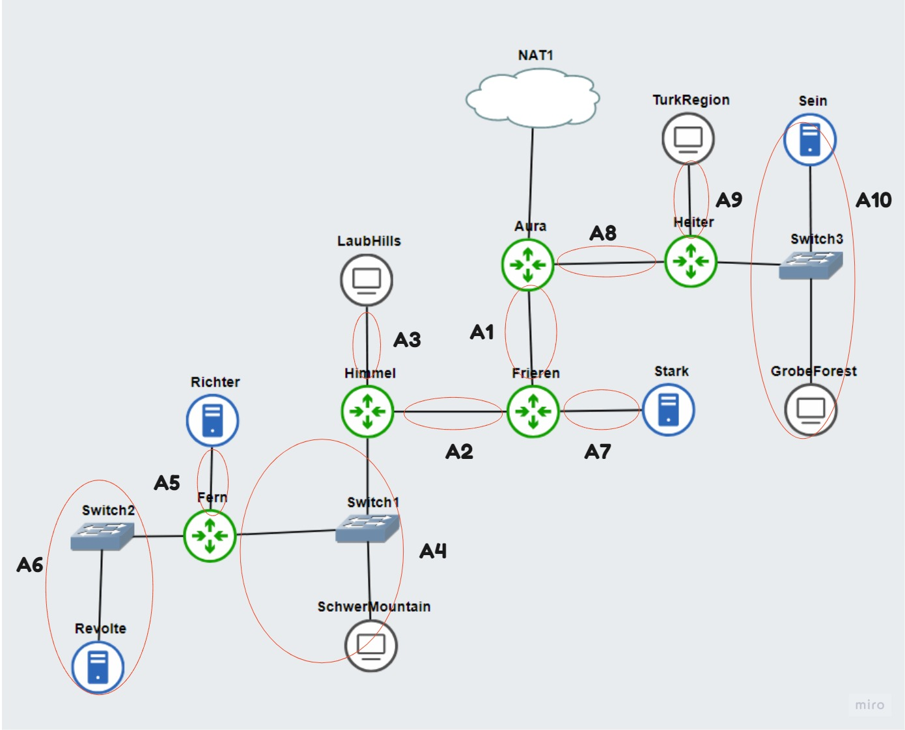

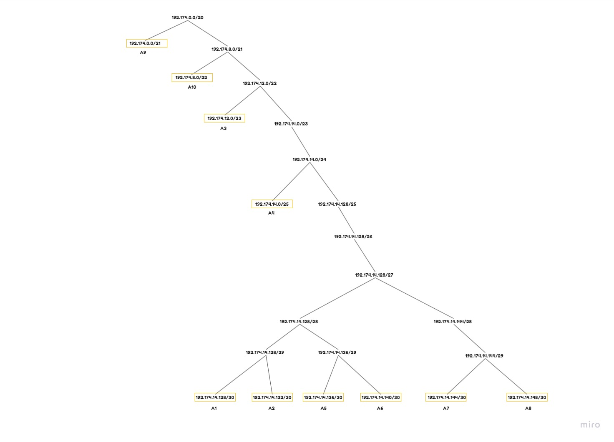

### Soal C

> Kemudian buatlah rute sesuai dengan pembagian IP yang kalian lakukan.

### Jawaban

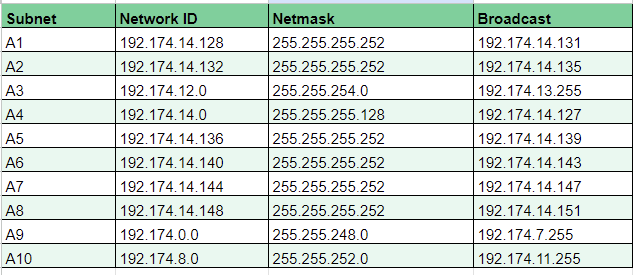

Dan dilakukan routing
**Aura**

```
route add -net 192.174.12.0 netmask 255.255.252.0 gw 192.174.14.130 # A2 & A7
route add -net 192.174.0.0 netmask 255.255.248.0 gw 192.174.14.150 # A9
route add -net 192.174.8.0 netmask 255.255.252.0 gw 192.174.14.150 # A10
```

**Fren**

```
route add -net 0.0.0.0 netmask 0.0.0.0 gw 192.174.14.1
```

**Frieren**

```
route add -net 0.0.0.0 netmask 0.0.0.0 gw 192.174.0.129
route add -net 192.174.12.0 netmask 255.255.254.0 gw 192.174.14.134 # A3
route add -net 192.174.14.0 netmask 255.255.255.128 gw 192.174.14.134 # A4
route add -net 192.174.14.136 netmask 255.255.255.248 gw 192.174.14.134 # A5
```

**Himmel**

```
route add -net 0.0.0.0 netmask 0.0.0.0 gw 192.174.0.133
route add -net 192.174.14.136 netmask 255.255.255.248 gw 192.174.14.2 # A5 & A6
```

**Heiter**

```
route add -net 0.0.0.0 netmask 0.0.0.0 gw 192.174.14.149`
```

### Soal D

> Tugas berikutnya adalah memberikan ip pada subnet SchwerMountain, LaubHills, TurkRegion, dan GrobeForest menggunakan bantuan DHCP.

### Jawaban

Pada ritcher atur lah sedemekian rupa agar dia menjadi DNS server

```
apt-get update
apt-get install isc-dhcp-server netcat -y
echo 'option domain-name "example.org";
option domain-name-servers ns1.example.org, ns2.example.org;

default-lease-time 20000;
max-lease-time 50000;

ddns-update-style none;

authoritative;

subnet 192.174.14.128 netmask 255.255.255.252{
}
subnet 192.174.14.132 netmask 255.255.255.252{
}
subnet 192.174.12.0 netmask 255.255.254.0{
    range 192.174.12.2 192.174.13.254;
    option routers 192.174.12.1;
    option broadcast-address 192.174.13.255;
    option domain-name-servers 192.174.14.138;
}
subnet 192.174.14.0 netmask 255.255.255.128{
    range 192.174.14.3 192.174.14.126;
    option routers 192.174.14.1;
    option broadcast-address 192.174.14.127;
    option domain-name-servers 192.174.14.138;
}
subnet 192.174.14.136 netmask 255.255.255.252{
}
subnet 192.174.14.140 netmask 255.255.255.252{
}
subnet 192.174.14.144 netmask 255.255.255.252{
}
subnet 192.174.14.148 netmask 255.255.255.252{
}
subnet 192.174.0.0 netmask 255.255.248.0{
    range 192.174.0.2 192.174.7.254;
    option routers 192.174.0.1;
    option broadcast-address 192.174.7.255;
    option domain-name-servers 192.174.14.138;
}
subnet 192.174.8.0 netmask 255.255.252.0{
    range 192.174.8.3 192.174.11.254;
    option routers 192.174.8.1;
    option broadcast-address 192.174.11.255;
    option domain-name-servers 192.174.14.138;
}
' > /etc/dhcp/dhcpd.conf
service isc-dhcp-server restart
```

Pada semua router (Aura,Heiter, Frieren, Himmel, dan Fern) aturlah agar menjadi DNS relay

```
apt-get update
apt-get install isc-dhcp-relay -y
echo 'SERVERS="192.174.14.142"
INTERFACES="eth0 eth1 eth2"
OPTIONS=""
' > /etc/default/isc-dhcp-relay
echo 'net.ipv4.ip_forward=1' > /etc/sysctl.conf
service isc-dhcp-relay start
```

### Soal 1

> Agar topologi yang kalian buat dapat mengakses keluar, kalian diminta untuk mengkonfigurasi Aura menggunakan iptables, tetapi tidak ingin menggunakan MASQUERADE.

### Jawaban

Pada Aura

```
iptables -t nat -A POSTROUTING -o eth0 -j SNAT -s 192.174.0.0/20 --to-source 192.168.122.2
```

Dan pada node lainnya

```
echo "nameserver 192.168.122.1" > /etc/resolv.conf
```

### Testing

lakukan kepada seluru node

```
ping google.com
```

### Hasil


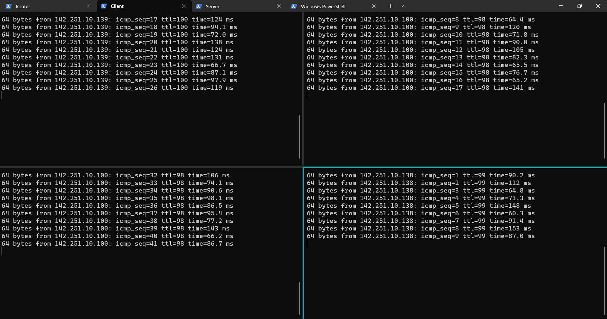

### Soal 2

> Kalian diminta untuk melakukan drop semua TCP dan UDP kecuali port 8080 pada TCP.

### Jawaban

pada semua Node

```
iptables -N NO_2
iptables -A NO_2 -p tcp -m multiport ! --dport 8080 -j DROP
iptables -A NO_2 -p udp -j DROP
iptables -A INPUT -j NO_2
```

### Testing

masukkan port 8080 dan IP

Pada TCP

```
nc -l -p <port> dan nc <ip> <port>
```

Pada UDP

```
nc -u -l -p <port> dan nc -u <ip> <port>
```

### Hasil

Diberikan contoh LaubHilss dan TurkRegion
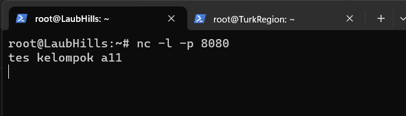

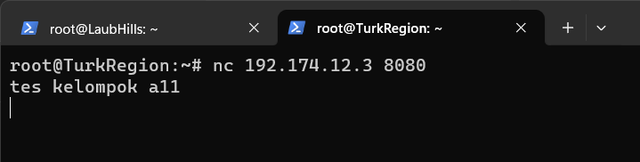

### Soal 3

> Kepala Suku North Area meminta kalian untuk membatasi DHCP dan DNS Server hanya dapat dilakukan ping oleh maksimal 3 device secara bersamaan, selebihnya akan di drop.

### Jawaban

Pada Richter dan Revolte

```
iptables -N NO_3
iptables -A NO_3 -p icmp --icmp-type echo-request -m conntrack --ctstate RELATED,ESTABLISHED -j ACCEPT
iptables -A NO_3 -p icmp --icmp-type echo-request -m connlimit --connlimit-above 3 --connlimit-mask 0 -j DROP
iptables -A INPUT -j NO_3
```

### Testing

lakukan testing dengan 4 node yang ping ke IP RItcher dan Revolte

### Hasil

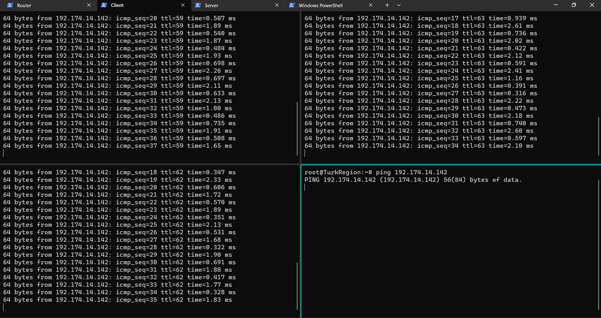

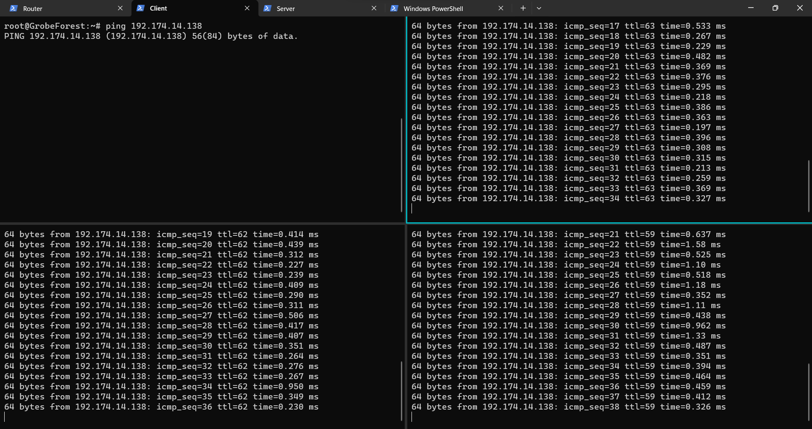

### Soal 4

> Lakukan pembatasan sehingga koneksi SSH pada Web Server hanya dapat dilakukan oleh masyarakat yang berada pada GrobeForest.

### Jawaban

Pada Web server Sein dan Stark

```
iptables -N NO_4
iptables -A NO_4 -p tcp --dport 22 -m iprange ! --src-range 192.174.8.3-192.174.11.254 -j DROP
iptables -A INPUT -j NO_4
```

### Testing

masukkan port 22 dan IP Sein dan Stark

Pada TCP

```
nc -l -p <port> dan nc <ip> <port>
```

Pada UDP

```
nc -u -l -p <port> dan nc -u <ip> <port>
```

### Hasil

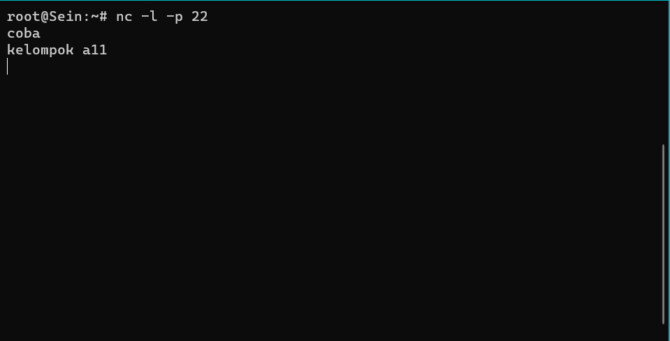

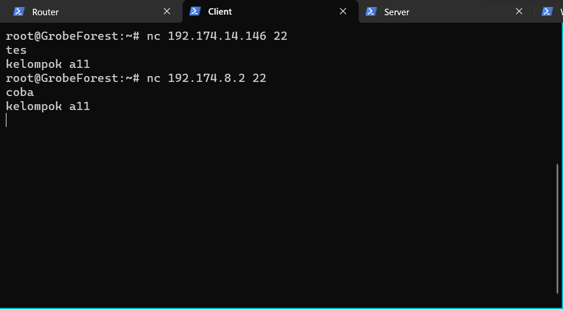

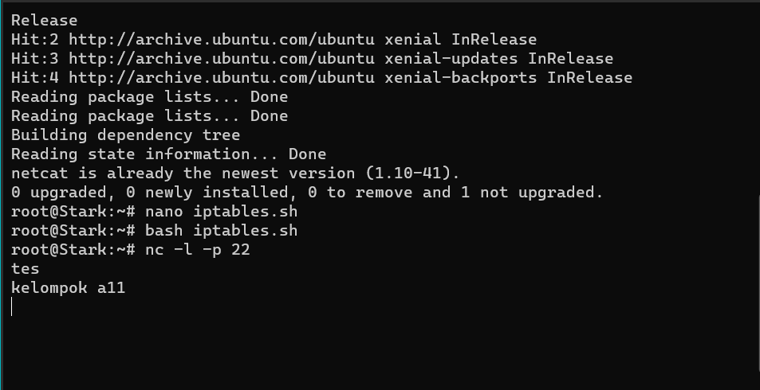

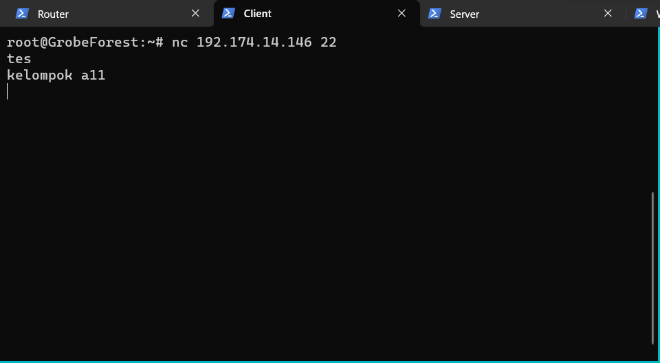

### Soal 5

> Selain itu, akses menuju WebServer hanya diperbolehkan saat jam kerja yaitu Senin-Jumat pada pukul 08.00-16.00.

### Jawaban

Pada Web server Sein dan Stark

```
iptables -N NO_5
iptables -A NO_5 -m time --weekdays Sat,Sun -j DROP
iptables -A NO_5 -m time --weekdays Mon,Tue,Wed,Thu,Fri --timestart 00:00 --timestop 07:59 -j DROP
iptables -A NO_5 -m time --weekdays Mon,Tue,Wed,Thu,Fri --timestart 16:01 --timestop 23:59 -j DROP
iptables -A INPUT -j NO_5
```

### Testing

setting timenya

```
date -s "19 DEC 2023 09:00"
```

lakukan ping ke IP Sein dan Stark

### Hasil

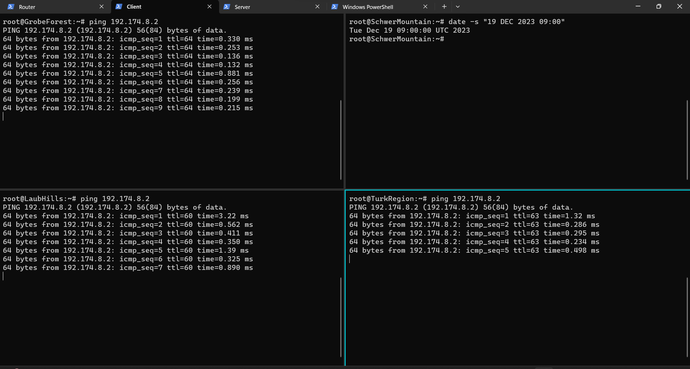

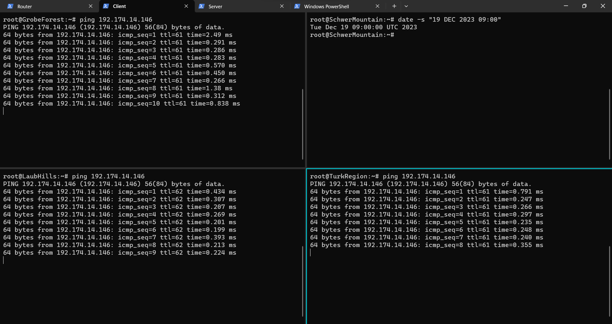

Jika jam tidak sesuai maka tidak bisa diakses


### Soal 6

> Lalu, karena ternyata terdapat beberapa waktu di mana network administrator dari WebServer tidak bisa stand by, sehingga perlu ditambahkan rule bahwa akses pada hari Senin - Kamis pada jam 12.00 - 13.00 dilarang (istirahat maksi cuy) dan akses di hari Jumat pada jam 11.00 - 13.00 juga dilarang (maklum, Jumatan rek).

### Jawaban

Pada Web server Sein dan Stark

```
iptables -N NO_6
iptables -A NO_6 -m time --timestart 12:00 --timestop 13:00 --weekdays Mon,Tue,Wed,Thu -j DROP
iptables -A NO_6 -m time --timestart 11:00 --timestop 13:00 --weekdays Fri -j DROP
iptables -A INPUT -j NO_6
```

### Testing

setting time dan harinya serta lakukan ping pada IP sein dan stark

```
date -s "18 DEC 2023 12:30"
dan
date -s "22 DEC 2023 12:00"
```

### Hasil

hasil pada hari senin jam 12.30
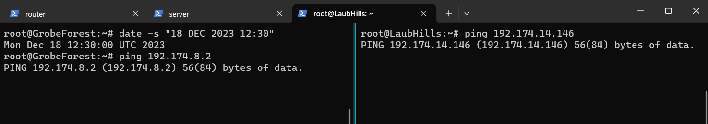

hasil pada hari jumat


### Soal 7
> Karena terdapat 2 WebServer, kalian diminta agar setiap client yang mengakses Sein dengan Port 80 akan didistribusikan secara bergantian pada Sein dan Stark secara berurutan dan request dari client yang mengakses Stark dengan port 443 akan didistribusikan secara bergantian pada Sein dan Stark secara berurutan

#### Jawaban
Lakukan perintah seperti di bawah ini pada Heiter.

```shell
iptables -t nat -N NO_7
iptables -A NO_7 -t nat -p tcp --dport 80 -d 192.174.8.2 -m statistic --mode nth --every 2 --packet 0 -j DNAT --to-destination 192.174.8.2
iptables -A NO_7 -t nat -p tcp --dport 80 -d 192.174.8.2 -j DNAT --to-destination 192.174.14.146
iptables -t nat -A PREROUTING -j NO_7
```

Kemudian jalankan perintah di bawah ini pada Frieren

```shell
iptables -t nat -N NO_7
iptables -A NO_7 -t nat -p tcp --dport 443 -d 192.174.14.146 -m statistic --mode nth --every 2 --packet 0 -j DNAT --to-destination 192.174.8.2
iptables -A NO_7 -t nat -p tcp --dport 443 -d 192.174.14.146 -j DNAT --to-destination 192.174.14.146
iptables -t nat -A PREROUTING -j NO_7
```
Lalu untuk melakukan pengetesan Heiter (port 80), jalankan script berikut ini di Sein 

```shell
while true; do nc -l -p 80 -c 'echo "Sein"';
```
Kemudian jalankan script berikut ini di Stark

```shell
while true; do nc -l -p 80 -c 'echo "Stark"'
```
Lalu di Sein/Stark jalankan ```nc 192.174.8.2 80``` 

Selanjutnya untuk melakukan pengetesan Frieren (port 443) sama saja seperti di atas tinggal ubah 80 menjadi 443.

### Soal 8
> Karena berbeda koalisi politik, maka subnet dengan masyarakat yang berada pada Revolte dilarang keras mengakses WebServer hingga masa pencoblosan pemilu kepala suku 2024 berakhir. Masa pemilu (hingga pemungutan dan penghitungan suara selesai) kepala suku bersamaan dengan masa pemilu Presiden dan Wakil Presiden Indonesia 2024.

#### Jawaban
Pasa node Frieren, jalankan perintah ini

```shell
iptables -N NO_8
iptables -A NO_8 -s 192.174.14.140/30 -d 192.174.8.2 -m time --datestop 2024-06-27 -j DROP
iptables -A NO_8 -s 192.174.14.140/30 -d 192.174.14.146 -m time --datestop 2024-06-27 -j DROP
iptables -A FORWARD -j NO_8
```

Lalu test dengan mengubah date sesuai yang diminta pada soal.

### Soal 9
> Sadar akan adanya potensial saling serang antar kubu politik, maka WebServer harus dapat secara otomatis memblokir  alamat IP yang melakukan scanning port dalam jumlah banyak (maksimal 20 scan port) di dalam selang waktu 10 menit. 
(clue: test dengan nmap)

### Jawaban
Pada Sein dan Stark jalankan seperti di bawah ini.

```shell
iptables -N NO_9
iptables -A NO_9 -m recent --name scan --update --seconds 600 --hitcount 20 -j DROP
iptables -A NO_9 -m recent --name scan --set -j ACCEPT
iptables -A INPUT -j NO_9
```
Kemudian untuk testing kita dapat melakukan dengan cara:
- Pada TurkRegion lakukan perintah ```date --set="20 Dec 2023 13.00"``` 
- Kemudian ping Sein ```ping 192.174.8.2``` 

### Soal 10
> Karena kepala suku ingin tau paket apa saja yang di-drop, maka di setiap node server dan router ditambahkan logging paket yang di-drop dengan standard syslog level. 

#### Jawaban

Diperlukan pencatatan log, oleh karena itu, untuk semua aturan iptables yang menggunakan opsi -j DROP, tambahkan aturan tambahan dengan batasan yang sama, namun menggunakan opsi -j LOG sebelum perintah untuk menolak.

Tetapi pada nomor 10 ini, kami tidak dapat menemukan file Log, akan tetapi jika kita ngecek menggunakan ```iptables -L -v``` akan ditemukan Log nya.


